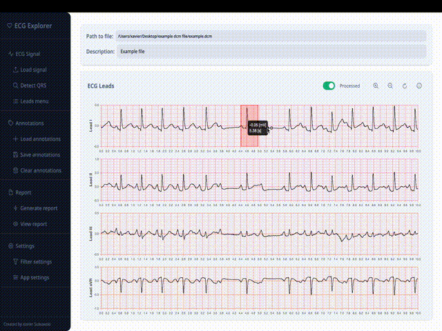

# ECG Explorer

The primary goal of **ECG Explorer** is to provide an intuitive and efficient platform for ECG data analysis. The application supports various ECG file formats, incorporates advanced signal processing techniques, and facilitates annotation and reporting of ECG data.

## Application Functionalities

The frontend of **ECG Explorer** is designed to deliver a seamless and interactive user experience. Key functionalities include:

- **ECG File Exploration**: Load ECG files in multiple formats for visualization and analysis.
- **Interactive Data Visualization**: View ECG signals in interactive charts with options to zoom, pan, and interact with the data.
- **Annotation Management**: View, edit, and manage annotations directly on ECG charts.
- **Report Generation**: Generate reports summarizing QRS complexes and other key features.
- **QRS Detection**: Detect QRS complexes using the Pan-Tompkins algorithm.
- **Filter Configuration**: Configure signal filters with adjustable settings.

## ECG Data Processing Workflow

**ECG Explorer** follows these key steps for data processing:

1. **Signal Acquisition**: Load ECG data from supported file formats (.dcm [DICOM] and .xml [GE XML]).
2. **Preprocessing**: Apply filters to remove noise and artifacts, improving signal quality.
3. **QRS Detection**: Detect QRS complexes and R-peaks using the Pan-Tompkins algorithm (optional).
4. **Annotation Management**: Manage annotations for detailed analysis and documentation.
5. **Report Generation**: Compile analysis results into comprehensive reports (currently QRS areas and lengths).

## For Users

### Installation

1. Install the application from the provided `.exe` file.
2. Open the application. The main window includes a menu bar on the left with all available options.
     
     
   
     
     

### Options

#### 1. **ECG Signal**
- **Load Signal**: Load ECG data from supported formats (.dcm and .xml).
    - After selecting a file, the application displays the signal in a chart. 
    - Additional options include switching between raw and processed signals, zooming, and resetting the view.
     
     
    
     
     

- **Filter Settings**: Configure filters to adjust the signal.
    - Available settings include:
        - **Filtering Method**: Bandpass or lowpass filtering.
        - **Lowcut/Highcut Frequencies**: Set frequency ranges for filtering.
        - **Filter Order**: Adjust filter precision (higher order improves separation).
         
         
        
         
         

    > **Note**: Filtering alters signal morphology.

 

- **Detect QRS**: Use the Pan-Tompkins algorithm to detect QRS complexes.
     
     
    
     
     
- **Lead Menu**: Select specific leads for display.
     
     
    
     
#### 2. **Annotations**
- **Load Annotations**: Import annotation files.
- **Save Annotations**: Export annotations to a file.
- **Clear Annotations**: Remove all annotations from the charts.

#### 3. **Report**
- **Generate Report**: Create a report summarizing QRS data and other metrics.

### How to Annotate on Signal
1. **Select Lead**: Choose the lead(s) to annotate.
2. **Zoom and Pan**: Use `Ctrl + Scroll` to zoom or `Ctrl + Drag` to pan.
3. **Click and Drag**: Create an annotation by dragging on the signal.
     
     
    
     
     
4. **Double-Click**: Select an annotation for editing (annotation turns green).
    - `Ctrl + D`: Delete the annotation.
    - `Ctrl + P`: Copy the annotation to other leads.
     
    
    
     
     

