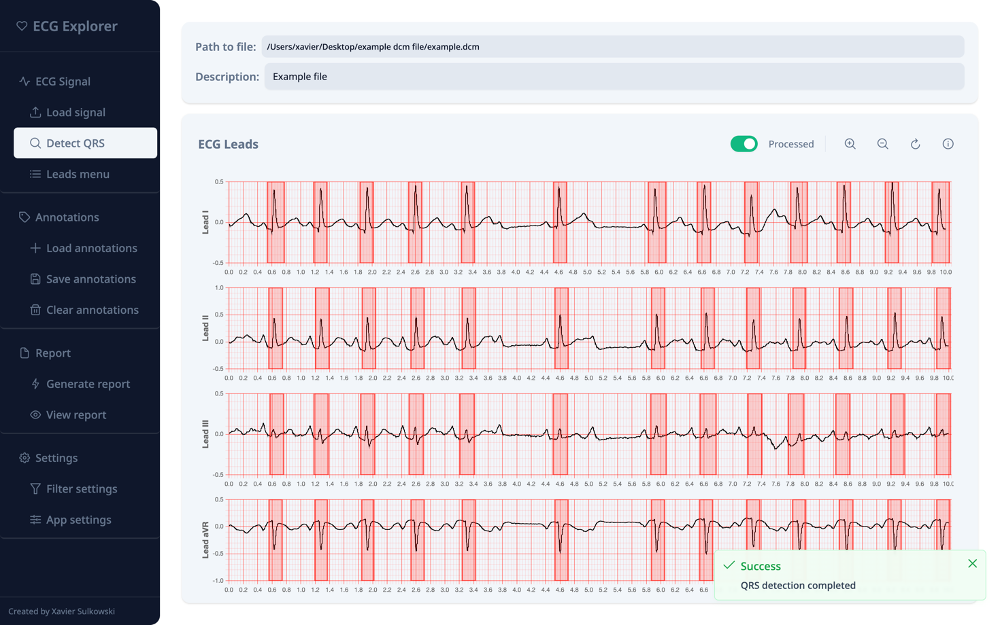
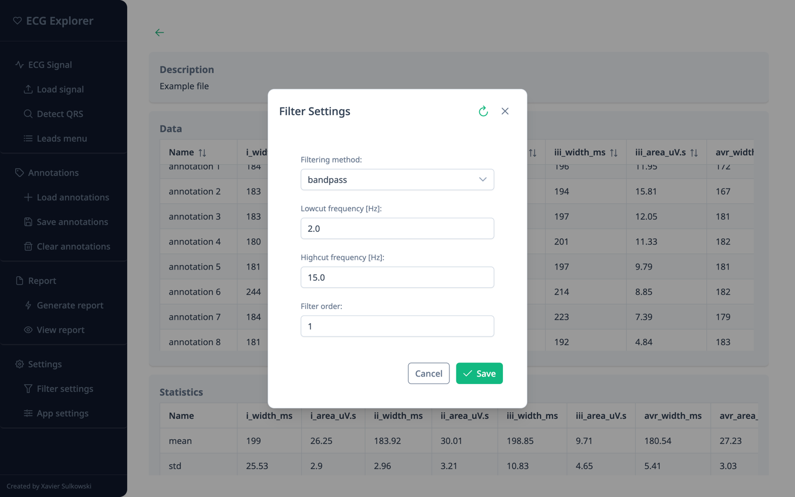
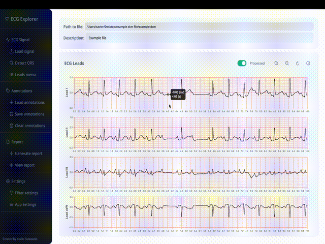

# ECG Explorer

**Note:** this is only a readme of the private project. It only showcase the applications. Reach me directly if you'd like to get more info. Thanks 🤙

**ECG Explorer** is an application designed for analyzing and visualizing electrocardiogram (ECG) data. Built with Electron, Vue, and TypeScript for the frontend, Python for the backend (FastAPI) and  for data processing. 

It provides healthcare professionals and researchers with tools to:
- load
- process
- visualize ECG signals
- manage annotations
- and generate reports

The application is still under development, and we welcome suggestions for improvement.

It handles all data locally to **ensure privacy and security**.

## Goal of the Application

The primary goal of **ECG Explorer** is to provide an intuitive and efficient platform for ECG data analysis. The application supports various ECG file formats. It incorporates advanced signal processing techniques.  I also facilitates annotation and reporting of ECG data.

## Application Functionalities

The frontend of **ECG Explorer** is designed to deliver a seamless and interactive user experience. Key functionalities include:

- **ECG File Exploration**: Load ECG files in multiple formats for visualization and analysis.
- **Interactive Data Visualization**: View ECG signals in interactive charts with options to zoom, pan, and interact with the data.
- **Annotation Management**: View, edit, and manage annotations directly on ECG charts.
- **Report Generation**: Generate reports summarizing QRS complexes and other key features.
- **QRS Detection**: Detect QRS complexes using the Pan-Tompkins algorithm.
- **Filter Configuration**: Configure signal filters with adjustable settings.

## ECG Data Processing Workflow

**ECG Explorer** follows these key steps for data processing:

1. **Signal Acquisition**: Load ECG data from supported file formats (.dcm [DICOM] and .xml [GE XML])
2. **Preprocessing**: Apply filters to remove noise and artifacts, improving signal quality
3. **QRS Detection**: Detect QRS complexes and R-peaks using the Pan-Tompkins algorithm (optional)
4. **Annotation Management**: Manage annotations for detailed analysis and documentation
5. **Report Generation**: Compile analysis results into comprehensive reports (currently QRS areas and lengths)

## Installation

1. Install the application from the provided `.exe` file
2. Open the application
     
     
   
     
     
3. On the home screen you can find: 
   - **"Quick Actions"**, because we love keep things handy 
   - **"Fun Fact"**, because learning is never enough
   - **"Contact Information"**, if you'd like to reach out to the author :)
   - **Sidebar Menu** on the left hand side, with all the functionalities

 

> **Note:** The sidebar menu is a panel menu, each element can be expanded.
     
     
   
     
     

---

## Functionalities 

All available in the sidebar menu.

### 1. **ECG Signal section** 

#### Load Signal

Load ECG data from supported formats (.dcm and .xml).

After selecting a file, the application displays a new window with the ECG data on the chart. 
 
 

 
 

On the screen there are two cards: 
1. File Info card with path to file & file description 
2. ECG data chart (ECG Leads)
   - it displays each lead individually as a separate row
   - it the right-top corner there are chart controls: 
       
       
      
       
       
       - toggle-switch to display processed/raw signal
       - zoom-in or zoom-out all charts at once 
       - reset view 
       - show info

#### Leads Menu 

Select leads to display.
 
 

 
 

#### Detect QRS 

Use the Pan-Tompkins algorithm to detect QRS complexes.
 
 

 
 

---

### 2. **Annotations**

Items in this panel allow to manipulate ECG data annotations.

#### Save annotations 
Export annotations to a file, in case you want to resume our research later

#### Load annotations 
Import annotation files 

#### Clear annotations
Remove all annotations from the charts

---

### 3. **Report**

#### Generate report 
Create a report summarizing QRS data and other metrics

#### View report 
Allow to browse created report. Currently, it only allows to browse generated CSV file. More to come :)   

> **Note:** in the left top corner, there is a "back arrow" that navigates back to the previous page  

---

### 4. Settings

> **Note:** all settings are persisted, so next time you open the application, you don't need to change anything.

#### Filter settings 

Configure filters to adjust the signal. 

Available settings include:
- **Filtering Method**: Bandpass or lowpass filtering.
- **Lowcut/Highcut Frequencies**: Set frequency ranges for filtering.
- **Filter Order**: Adjust filter precision (higher order improves separation).
 
 

 
 

>**Note**: Filtering alters signal morphology.

 

#### App settings 

Changes app settings. 

For now:
- **Collapsible menu**: controls if the side menu should collapse when it's not hovered. False by default
- **Auto-open report after generation**: controls if ECG Explorer should open a report immediately after it's generated. True by default

--- 

### Quick Actions

Let's go back to the main screen. 

> You can always do that by clicking on the "<3 ECG Explorer" at the top of the side menu.

There are buttons that we already know:
- Load ECG Signal 
- Filter Settings 
- View Report 
- App Settings

 
And one we don't know yet - **Resume Analysis**.

If you clicked “<3 ECG Explorer” at the top of the side menu during analysis, you can resume the analysis. All annotations will be persisted.   

---

### How to Annotate on Signal
1. **Select Lead**: Choose the lead(s) to annotate.
2. **Zoom and Pan**: Use `Ctrl + Scroll` to zoom or `Ctrl + Drag` to pan.
3. **Click and Drag**: Create an annotation by dragging on the signal.
     
     
    
     
     
4. **Double-Click**: Select an annotation for editing (annotation turns green).
   - `Ctrl + P`: Copy the annotation to other leads.
   - `Ctrl + D`: Delete the annotation.
    
    
   
    
    
